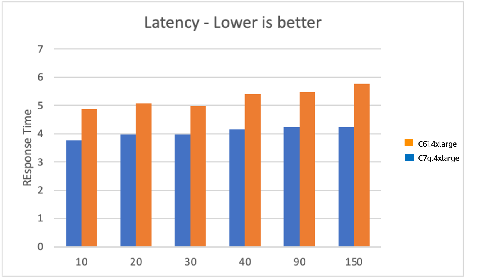
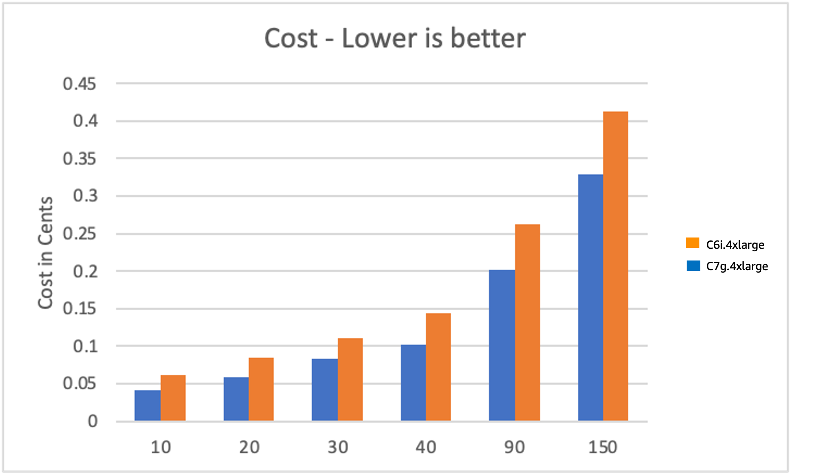

import CollapsibleContent from '../../../../src/components/CollapsibleContent';

:::caution

The example model used in this blueprint [bartowski/Llama-3.2-1B-Instruct-GGUF](https://huggingface.co/bartowski/Llama-3.2-1B-Instruct-GGUF) requires access through a Hugging Face account.

:::

# Cost effective and Scalable Model Inference on AWS Graviton with Ray on EKS

## Overview
The solution implements a scalable ML inference architecture using Amazon EKS, leveraging Graviton processors. The system utilizes Ray Serve for model serving, deployed as containerized workloads within a Kubernetes environment. 

## Prerequisites
1. EKS cluster with Ray operater installed
2. Karpenter node pool is setup for Graviton instance, the node pool label is "kubernetes.io/arch: arm64" in this example
3. Make sure running following command under the llamacpp-rayserve-graviton directory

## Deployment
Deploy an elastic Ray service hosting llama 3.2 model on Graviton:

### 1. Edit your Hugging Face token for env `HUGGING_FACE_HUB_TOKEN` in the secret section of `ray-service-llamacpp.yaml`

### 2. Configure model and inference parameters in the yaml file:
   - `MODEL_ID`: Hugging Face model repository
   - `MODEL_FILENAME`: Model file name in the Hugging Face repo
   - `N_THREADS`: Number of threads for inference (recommended: match host EC2 instance vCPU count)
   - `CMAKE_ARGS`: C/C++ compile flags for llama.cpp on Graviton

> Note: The example model uses GGUF format, optimized for llama.cpp. See [GGUF documentation](https://huggingface.co/docs/hub/en/gguf) for details.

### 3. Create the Kubernetes service:
```bash
kubectl create -f ray-service-llamacpp.yaml 
```

### 4.Get the Kubernetes service name:
```bash   
kubectl get svc 
```

## How do we measure
Our client program will generate 20 different prompts with different concurrency for each run. Every run will have common GenAI related prompts and assemble them into standard HTTP requests, and concurrency calls will keep increasing until the maximum CPU usage reaches to nearly 100%. We capture the total time from when a HTTP request is initiated to when a HTTP response is received as the latency metric of model performance. We also capture output token generated per second as throughput. The test aims to reach maximum CPU utilization on the worker pods to assess the concurrency performance.

Follow this guidance if you want to set it up and replicate the experiment

### 1. Launch load generator instance
Launch an EC2 instance as the client in the same AZ with the Ray cluster (For optimal performance testing, deploy a client EC2 instance in the same AZ as your Ray cluster. To generate sufficient load, use a compute-optimized instance like c6i.16xlarge. If you observe that worker node CPU utilization remains flat despite increasing concurrent requests, this indicates your test client may be reaching its capacity limits. In such cases, scale your testing infrastructure by launching additional EC2 instances to generate higher concurrent loads.)

### 2. Execute port forward for the ray service
```bash
kubectl port-forward service/ray-service-llamacpp-serve-svc 8000:8000
```

### 3. Configure environment
Install Golang environment in the client EC2 instance (please refer [this](https://go.dev/doc/install) for the Golang installation guidance). Specify the environment variables as the test configuration.

```bash
export URL=http://localhost:8000/v1/chat/completions
export REQUESTS_PER_PROMPT=<The_number_of_concurrent_calls>
export NUM_WARMUP_REQUESTS=<The_number_of_warmup_requests>
```

### 4. Run test
Run the performance test golang script and you can find the results from the output. 

```bash
go run perf_benchmark.go
```

## Result
Let us see a benchmark result with above steps

### Performance
You have an average latency reduction of 22% with c7g.4xlarge as compared to c6i.4xlarge. Further more, you can find out Graviton performance is more sustainable, even under high concurrency, the latency performance is keeping stable.



### Cost
The fleet we use consists of 10 4x large machines for worker pods. Using simple AWS calculator the cost in Sydney region for c6i.4xlarge is 0.888 hourly and c7g.4xlarge is 0.7549 hourly. We calculate the cost based on the benchmark duration, then figure out the data in following chart,  Graviton clearly has a benefit of 30% cost saving while also leading in the performance benchmarks, and from the trend you can see the more requests, the more cost saving from Graviton. We are using these numbers for comparison between Intel and Graviton, naturally there are AWS savings such as savings plan can be applied to further reduce cost for both.


